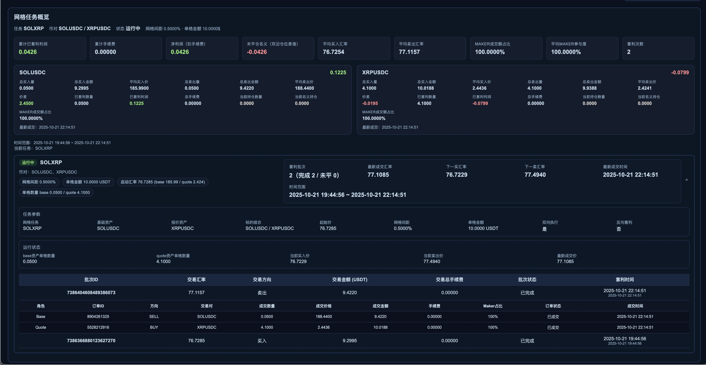

# SmartPool Quant Stack




## 概览

SmartPool 聚合了震荡量化、双币网格和可视化看板三大模块：

- `icu/smartpool/Main.js` 定时批量拉取币对行情，筛选震荡对并写入最新批次数据。
- `icu/smartpool/grid/` 按 `icu/smartpool/grid/data/grid_tasks.json` 中的配置运行单币或双币网格策略。
- `icu/smartpool/WebServer.js` 提供 `http://localhost:3000`，用于浏览最新批次和网格执行情况。

各模块通过 `icu/smartpool/service/SmartPoolMapper.js` 共享 `icu/smartpool/data/latest.json`，并约定将运行产物输出到
`icu/smartpool/data/` 与 `icu/smartpool/grid/data/`。

## 环境 & 启动

```bash
# 使用 Node 18+，一次性安装依赖
npm install express piscina lowdb axios node-binance-api

# 运行震荡量化批次
node icu/smartpool/Main.js

# 启动双币网格循环
node icu/smartpool/Grid.js

# 打开看板服务
node icu/smartpool/WebServer.js
```

- `node --watch icu/smartpool/Main.js` 可用于本地调试（勿提交 watch 脚本）。
- Web 端首页 `/` 展示震荡批次摘要，`/dashboard` 聚焦网格任务详情。

## 震荡量化批次（Main.js）

`Main.js` 是系统核心，流程如下：

1. 读取 `common/Config.js` 中声明的各个量化周期。
2. 通过 `service/CzClient.js` 拉取交易对列表与行情，并把每个 symbol 分派给线程池 (`Piscina`)。
3. 线程池中的 `service/worker.js` 调用 `service/SmartPoolService.js`：该服务维护 K 线缓存、计算震荡指标、给出振幅/得分/价位段，是量化回路的核心。
4. `Main.js` 将阶段结果依次保存为 `symbolList`、`rltArr`、`centerList`、`highList`、`lowList`、`highLowList`、`data`。
5. 由 `service/SmartPoolMapper.js` 将批次快照持久化到 `data/latest.json`，供前端和 API 消费。
6. 基于上一轮高分交易对缓存调节批次长度，实现高频增量滚动。

当某阶段出现异常或行情为空时，会自动重试并按需调整后续调度间隔。

## 双币网格引擎（Grid.js）

`Grid.js` 作为入口调用 `grid/GridTaskManage.js`：

- `GridTaskManage.js` 负责读取任务配置、轮询状态、分发到 `GridTaskHandler.js`，并调度相关k线 socket的订阅/退订。
- `Grid/data/grid_tasks.json` 列举任务的 `id`、`baseAssert`、`quoteAssert`、`gridRate`、`gridValue` 等参数。
- `GridTaskHandler.js` 实现每个任务的执行逻辑：触发建仓、根据实时价格决定买卖方向、调用 `grid/common/CzClient.js` 下单，并在
  `grid/OrderMapper.js` 中记录订单。
- 任务启动时会订阅实时行情 (`grid/common/BockTickerManage.js`)，并在需要时放置初始仓位。
- 运行阶段根据买入/卖出触发条件生成委托单，通过 `grid/OrderMapper.js` 将委托与成交记录写入
  `grid/data/orders-<taskId>.json`。
- 循环中实时校验参数有效性，异常任务会被标记为 `EXPIRED` 以防止重复下单。

示例任务可参考现有的 `grid/data/grid_tasks.json`。

## 可视化看板（WebServer.js）

`WebServer.js` 基于 Express 提供两个主要页面：

- `view/home.html`：概览批次时间、周期列表、阶段数据量。
- `view/dashboard.html`：按任务聚合多币对网格表现。

API 入口：

- `GET /api/data` 与 `/api/data/{stage}`：读取 `data/latest.json` 中的指定周期快照。
- `GET /api/orders?taskId=<id>`：聚合 `grid/data/orders-*.json` 内的委托与成交信息。

当批次数据缺失时接口会返回 404，方便运维检测。

## 数据与日志

- 震荡数据：`data/latest.json` 由量化批次自动维护。
- 网格配置：`grid/data/grid_tasks.json`；运行日志与订单落地在 `grid/data/`。
- 长期日志与通用工具位于 `grid/common/`，建议以 `grid/common/logger.js` 替代散落的 `console.log`。
- Binance API 密钥等敏感信息请使用环境变量（`BINANCE_API_KEY`、`BINANCE_API_SECRET`），勿直接写入仓库。

## 开发提示

- 覆盖边界场景（空交易对、无效 `gridRate`、持久化失败）后再提交代码。
- 单元测试可使用 `node:test`，命名为 `<module>.test.js` 并放在同级目录。
- 仅提交可重放的固定数据，个人运行产生的快照与日志请放在 `.gitignore` 中。

以上流程配合 home/dashboard 页面截图，可帮助快速理解当前 SmartPool 量化栈。
